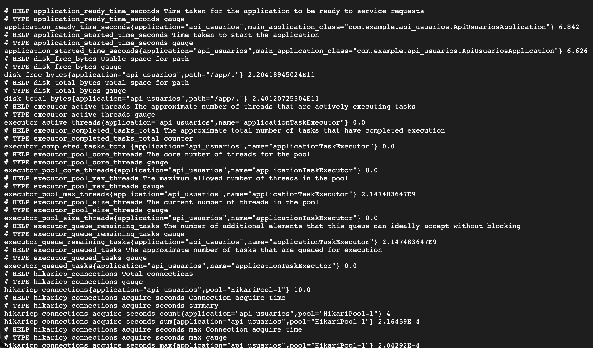
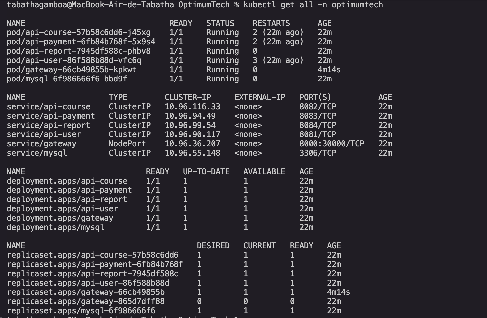

## Levantar el stack con Docker Compose

Sigue estos pasos para iniciar todos los microservicios y la base de datos usando Docker Compose:

1. Asegúrate de tener Docker y Docker Compose instalados en tu sistema.
2. Clona este repositorio y navega a la carpeta principal del proyecto (`OptimumTech`).
3. Ejecuta el siguiente comando:

	```sh
	docker compose up --build
	```

Esto construirá las imágenes y levantará todos los servicios definidos en `docker-compose.yml`.

Para detener los servicios, usa:

	```sh
	docker compose down
	```

El volumen `mysql_data` asegura la persistencia de los datos de MySQL entre reinicios.
# Implementación de GitFlow

## Metodología de branching elegida: GitFlow

Se eligió **GitFlow** como estrategia de control de versiones para este proyecto.

### Justificación

GitFlow fue elegido porque:

- Separa el código estable (`main`) del código en integración (`develop`), reduciendo riesgos en producción.
- Permite desarrollar múltiples features en paralelo sin que se interfieran.
- Facilita correcciones urgentes (`hotfix/*`) directamente desde `main` sin afectar el desarrollo activo.
- Hace el flujo de revisión más claro y ordenado mediante Pull Requests.

### Estructura de ramas

```
main        → código en producción (estable)
develop     → integración de features en desarrollo
feature/*   → nuevas funcionalidades (salen de develop)
hotfix/*    → correcciones urgentes (salen de main)
```

## Naming de ramas

- `feature/<nombre-corto>` para funcionalidades nuevas
- `hotfix/<nombre-corto>` para correcciones urgentes

Ejemplos:

- `feature/crear-readme`
- `hotfix/correccion-readme`

## Flujo de merge

Se sigue el flujo de GitFlow:

1. Las ramas `feature/*` nacen de `develop` y se integran por Pull Request a `develop`.
2. Las ramas `hotfix/*` nacen de `main` y se integran por Pull Request a `main`.
3. Luego de un hotfix, se sincroniza `main` hacia `develop` para mantener ambas ramas alineadas.

## Estrategia de revisión (Pull Requests)

- Cada cambio se integra mediante Pull Request.
- Antes de aprobar, se valida:
	- que el objetivo del cambio esté claro.
	- que no rompa el flujo existente.
	- que la acción de GitHub Actions esté en estado exitoso.

# Implementación Prometheus

Se implemento prometheus para cada microservicio, se pueden visualizar en entorno local a traves de:
### Paso a paso
```bash

# 1. Levantar el stack
docker compose up --build

# 2. Verificar que los servicios están corriendo
docker compose ps

# 3. Probar el endpoint de métricas en cada servicio
curl http://localhost:8082/actuator/prometheus   # api_course
curl http://localhost:8081/actuator/prometheus   # api_user
curl http://localhost:8083/actuator/prometheus   # api_payment
curl http://localhost:8084/actuator/prometheus   # api_report
curl http://localhost:8000/actuator/prometheus   # gateway


```
### Evidencia: 


# Implementación Kubernet 
Desplegamos los 5 microservicios en un clúster Kubernetes local usando kind, con manifiestos organizados por servicio (Deployment, Service, Secret) y verificamos que los 6 pods (incluido MySQL) quedaron en estado Running.
### Paso a Paso

```bash
# 1. Instalar kind (solo la primera vez)
brew install kind

# 2. Crear el cluster
kind create cluster --name optimumtech

# 3. Construir las imágenes Docker
docker compose build

# 4. Cargar las imágenes en el cluster kind
kind load docker-image optimumtech-api_course:latest --name optimumtech
kind load docker-image optimumtech-api_user:latest --name optimumtech
kind load docker-image optimumtech-api_payment:latest --name optimumtech
kind load docker-image optimumtech-api_report:latest --name optimumtech
kind load docker-image optimumtech-gateway:latest --name optimumtech

# 5. Desplegar todo
./k8s/deploy.sh

# 6. Verificar que todos los pods están Running
kubectl get pods -n optimumtech

# 7. Acceder al gateway desde el navegador
kubectl port-forward -n optimumtech service/gateway 8000:8000

```


### Evidencia:


Agregamos Prometheus y Grafana al proyecto para visualizar en tiempo real métricas de los microservicios como CPU, memoria, requests y errores.

# Implementación Dashboard
```bash
docker compose up --build
# Prometheus → http://localhost:9090
# Grafana    → http://localhost:3000 

```

### Evidencia: 


### Resumen Herramientas en la Pipeline:

Para el monitoreo y observabilidad tenemos erramientas como Prometheus y grafana, que permiten visualizar métricas clave como errores, uso de recursos, entre otros, ayudando a la toma de desiciones tecnicas.
Para ello también esta el Dashboar de Métricas para tener una mejor trazabilidad del sistema, que incluye el tiempo de despliegue y cobertura de pruebas.

Para la calidad y el cumplimiento (Quality Gates) tenemos test unitarios y JaCoCo que validan el correcto funcionamiento y que se cumpla con un umbral mínimo.
Snyk analiza todas las dependencias del sistema, donde en caso de existir alguna severidad crítica, bloquea la pipeline.
SonarCloud audita la calidad y seguridad del código, donde bloquea el proceso si el Quality Gate resulta en error.
Y finalmente la Proteccion de Ramas, donde se pide que todos los estados anteriores hayan pasado en verde para poder permitir recién un merge. 
Todas estas herramientas permiten la visualización del sistema de forma mas detallada, agilizando el proceso para solucionar problemas y toma de decisiones sobre ello. 


